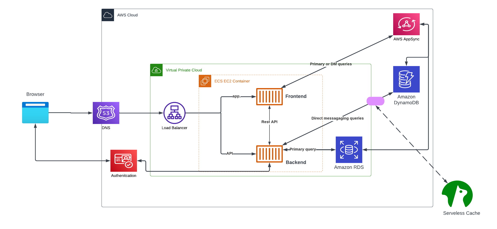
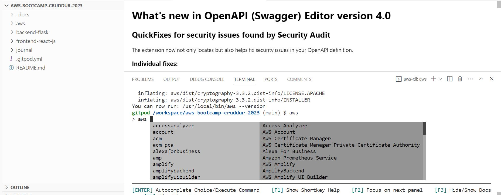
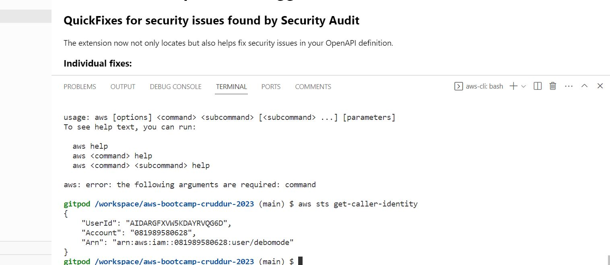
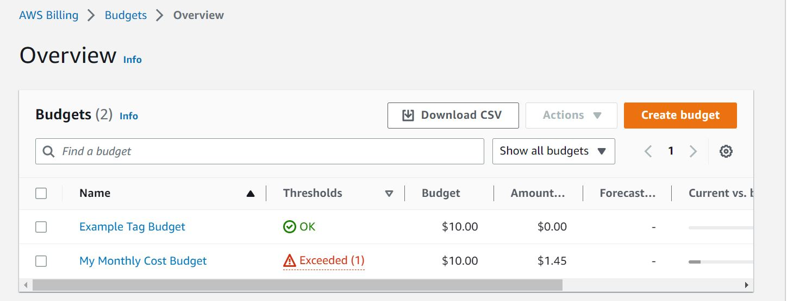

# Week 0 — Billing and Architecture

## Required Home/Task

### Creating Arichtecture Digram 
 I was able to create the digram using lucid 

[Lucid Chart Shared Link](https://lucid.app/lucidchart/c49b647d-3656-4aa6-a577-a63cb9df7623/edit?viewport_loc=-641%2C-71%2C2208%2C828%2C0_0&invitationId=inv_631519dc-bd59-4ddd-aed3-39fe1ca93c91)

### Install and verify AWS CLI

I was able to install cli on my browser but before i could install, i had 2 error messages . 
I followed instructions from your video 

```
1. install: 78: /workspace/aws/dist/aws: Exec format error Found preexisting AWS CLI installation: /usr/local/aws-cli/v2/current. Please rerun install script with --update flag
2. You don't have permissions to push to "debug  on GitHub
``````
I was able to solve the issues 

Error 1. , by dowloading the awscliv2.zip file again and overwritting the aws folder after unzipping and then ran the installation file.

For error message 2, i had to grant read write permission  in GitHub Gitpod streamlines developer workflows by providing prebuilt, collaborative development environments in your browser.




### Create Budget Alert
I created a new budget of $10. I created one a while ago when i was playing around with aws console.

